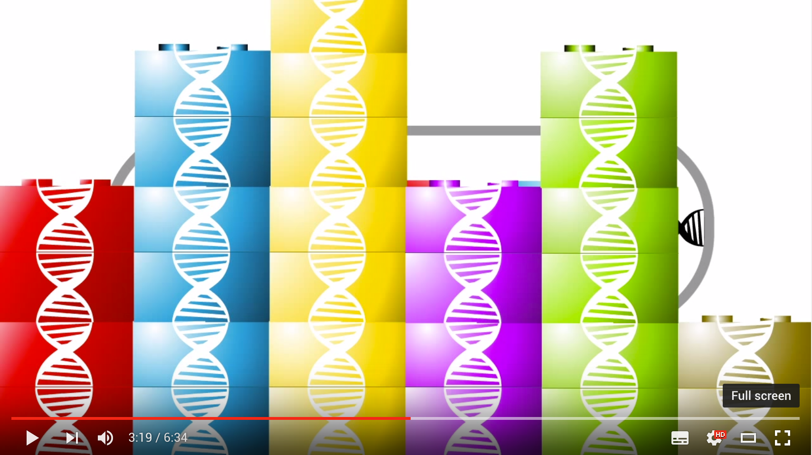

> A curated list of Synthetic Biology / Genetic Engineering projects, articles and resources. The main idea is that everyone can contribute here, so we can have a central repository of informations about this fascinating subject that we all can keep up-to-date.

Inspired by the [awesome](https://github.com/sindresorhus/awesome) list thing.

## Synthetic Biology Explained

## Articles

- [A programming language for living cells](http://news.mit.edu/2016/programming-language-living-cells-bacteria-0331): New language lets researchers design novel biological circuits.
- [Artificial Molecules](http://www.sciencealert.com/scientists-have-discovered-a-way-to-make-their-own-molecules): Scientists have figured out how to make their own molecules from scratch.
- [DNA Data Storage](http://blogs.discovermagazine.com/d-brief/2016/04/08/dna-data-storage/#.Vw1rmnUrLVO): DNA Data Storage Moves Beyond Moore’s Law.
- [Scientific Swap Meet Behind the gene-editing Boom](https://www.technologyreview.com/s/601156/the-scientific-swap-meet-behind-the-gene-editing-boom): The gene-editing technology called CRISPR is probably the fastest-spreading technology in the history of biology.

## Software

- [Cello Cad](http://www.cellocad.org/): Genetic circuit design automation.
- [(Poly)merase](https://github.com/TimothyStiles/poly) - A Go library and command line utility for engineering organisms.
- [GENtle2](https://github.com/Synbiota/GENtle2): Web-Based DNA Editor for Synthetic Biology.
- [Gigabase](http://derk-jan.me/programming-life/): Brogramming for life.
- [fpSelection](http://fpselection.org/): fpSelection tool uses a set of algorithms for solving these problems efficiently to design n-color fluorophore panels that are optimized for maximal signal, minimal bleed-through, and other biological parameters for a specific fluorescent measurement instrument.

## Programming Languages

- [Verilog (Cello)](https://github.com/CIDARLAB/cello2): A genetic logic synthesis tool. A high-level logic specification written in Verilog (a hardware description language) can be synthesized to give a plasmid containing logic gates.
- [Eugene](http://eugenecad.org/): Eugene is a human- and machine-readable language for specifying the design of biological systems. It allows users to generate biological designs based on customizable constraints, such as the maximum number of included genetic parts, the directionality of specific components, or the total sequence length of the output device. [Specification](https://lab.eugenecad.org/documentation.html)

## Hardware

- [BioHackAcademy](https://github.com/biohackacademy): hardware design file repos from [Waag's BioHackAcadamy](http://biohackacademy.github.io/) online(?) course 
- [3DuF](https://3duf.org): Open souce design tool for microfluidics design.

## Interviews

- [Autodesk](https://youtu.be/iRO0-fMIW9I/): Synthetic Biology - Inventing the Future.

## Standards
- [SBOL](https://sbolstandard.org/): Standard interchange format to exchange information between design tools and scientists.
- [SBML](http://sbml.org/): Standards to describe mathematical models for biological systems. 

## Resources
- [Golden Synthetic Biology Cluster](https://golden.co/wiki/Cluster%3A_Synthetic_biology): A cluster of topic pages related to Synthetic Biology
- [Gene Design](https://github.com/GeneDesign/GeneDesign): Synthetic biology library in Perl
- [SBOL](https://github.com/SynBioDex/libSBOLj): Java Library for Synthetic Biology Open Language (SBOL)
- [Addgene](https://www.addgene.org/): is a nonprofit plasmid repository that archives and distributes high quality plasmids.
- [compsynbio.org](https://compsynbio.org): is the course website for Boston University's "Computational Synthetic Biology for Engineers". Website features complete lecture slide decks, reading assingments and open-sourced project repos.

## Contributing

Your contributions are always welcome! [Click Here to read the guidelines](https://github.com/websemantics/awesome-synthetic-biology/blob/master/contributing.md).

## License

This work is licensed under a [Creative Commons Attribution 4.0 International License](http://creativecommons.org/licenses/by/4.0/).

[Marine](https://moleculamaxima.com/wp-content/uploads/2015/07/marine.png) image is courtesy of, https://moleculamaxima.com/
